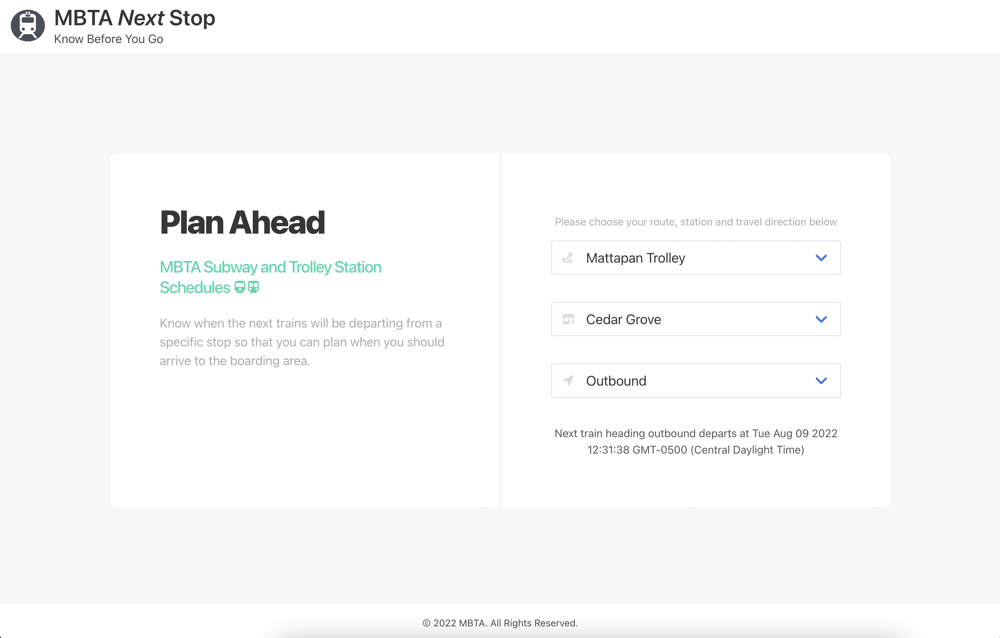

# MBTA-Next-Stop
A prototype web app for the MBTA (Metro Boston Transit Authority) written in Python, Flask and JavaScript

## Introduction

The backend API service is written in Python + Flask and demonstrates a backend service (API) to find the next departing train on the MBTA T network. This service utilizes the the MBTA public API available at https://api-v3.mbta.com to achieve the following:

1. Provide a list of routes that only service Light and Heavy Rail trains.
2. Provide a list of stops related to a selected route.
3. Provide the route directions for a given stop.
4. Provide the next predicted departure time for a train based on the route, stop and route direction selected.



This information is provided via API in JSON to a separate frontend web application client (MBTA Next Stop), which is the included frontend web application written in HTML + CSS + JavaScript, and located in the **/frontend** folder path.

_Note: You will need to obtain a **Free API Key** from MBTA at https://api-v3.mbta.com and then update the **.env** file located in the **/backend** folder path with the key before you can make requests._


## Requirements
You will need a copy of Python 3.8.x installed along with HomeBrew (if on a Mac). For testing the API endpoint you will also need a copy of Postman to use the included Postman collection file.

- Python 3.x [Installation Instructions](https://www.python.org/downloads/)
- Postman [Download Here](https://www.postman.com/downloads/)


## Installation and Setup
1. Setup a local virtual environment to install the Python dependencies without affecting the rest of your system. For Windows users, there is a Windows port of pyenv available [here](https://github.com/pyenv-win/pyenv-win).

_Mac Users:_ You will need HomeBrew installed on your Mac (if it isn't already). If it isn't you can get the latest release by running the following command in your terminal:

```
/bin/bash -c "$(curl -fsSL https://raw.githubusercontent.com/Homebrew/install/master/install.sh)
```

Then run the following commands (one at a time) to install the necessary dependencies:

```
brew update

brew install pyenv

brew install pyenv-virtualenv

pyenv install 3.8.5
```

Next, you will create the virtual environment:

```
pyenv virtualenv 3.8.5 mbta-next-stop
```

To activate this virtual environment use:

```
pyenv activate mbta-next-stop
```

_Note: You can deactivate this later by changing activate to deactivate_

Next, navigate to the **/backend** directory:

```
cd backend
```

Now it is time to install the dependencies by running:

```
pip install -r requirements.txt
```

Finally, for the frontend web application, we will install a simple HTTP server to serve the static files properly on our local machine. This will also be helpful when running the Selenium automated tests. Run the following to install it globally:

```
npm install http-server -g
```


## Starting the Backend Service

First make sure you are in the virtual environment you created earlier, then run:

```
python app.py
```

You can make sure it is working by opening http://localhost:5000/ in your browser and you should see a message that says "This service is working."

_Optionally,_ if you need to change the default port from 5000 to another port you can use the **-p** flag along with the desired port number:

```
python app.py -p 5001
```

If you do change the port, please also remember to update the port on the frontend app in the **assets/js/app.js** file at the top in the _baseURL_ value.

_Note: You can press Control + C to stop the service at any time_


## Starting the Frontend Service

Go to the **/frontend** directory and run:

```
http-server
```

It will serve the directory on localhost port 8080 by default. View it at http://localhost:8080.


## Testing the API using Postman
For testing the API endpoint, a Postman collection file has been provided in the **postman** directory.

1. Open Postman, then import the provided collection file **MBTA.postman_collection.json**.

2. Make sure the backend service is running (see steps above) then click on GET APIs within this collection and then click Send. You should get back the expected JSON response. You can try modifying the input values in the URL path to see how this changes the response data. Leaving any required values out of the URL path will return an error message.


## Automated Testing

There are two types of automated tests included with this code challenge. One for Python and the backend service and one for the frontend web app UI.

### Python Unit Tests

Python Unit Tests have been included in the **tests** directory to test the basic functions of this backend service. To run these first navigate to the **/backend/tests** directory using:

```
cd backend/tests
```

Then run the following to begin the tests:

```
python -m unittest -v
```

The tests are successful if you see all 11 tests run with an **OK**.


### Selenium Tests (UI)

The **/frontend** directory path also contains a **tests** folder with a file containing a few Selenium IDE tests to be used with the Selenium IDE Chrome Browser plugin. These tests will simulate user interaction with the frontend web application in a Chrome Web Browser.

The tests were created using Selenium IDE and requires using the Chrome web browser along with the free Selenium IDE Chrome Extension which you can get at https://chrome.google.com/webstore/detail/selenium-ide/mooikfkahbdckldjjndioackbalphokd. Once you have installed the free extension, use the test file located in the **tests** directory.

#### Setting Up the Tests (Requires Google Chrome):

1. First make sure you are able to access the web app in your browser. Navigate to **/frontend** in your terminal and run:

```
http-server
```

This will make the web app available at http://localhost:8080. Please open this path in your Chrome web browser.

2. Click on the Selenium IDE extension from the Chrome extension menu to launch. Then choose Open an existing project.

3. Select the **mbta-next-stop-tests.side** file from the **/frontend/tests** directory to open it.

4. Click on **Run All Tests** button. Optionally you can select a test and click the button just to the right of Run All Tests to just run the individual test.

_If the tests are failing, please adjust the playback speed to about 50-75% to allow for enough time for the fields to populate in the UI. They will not work at 100% (Fast) speed which is usually the default._

**Important Note:** Make sure to have the Python backend service running along with the frontend web application before running the Selenium tests.


## Changelog

**v1.0**
- Initial Release